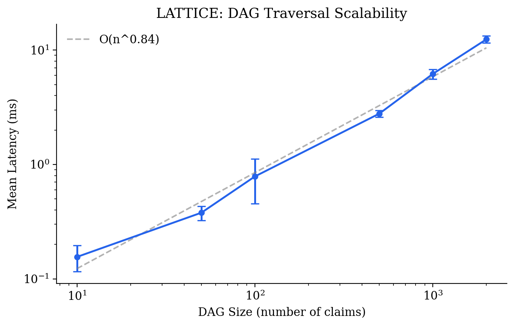
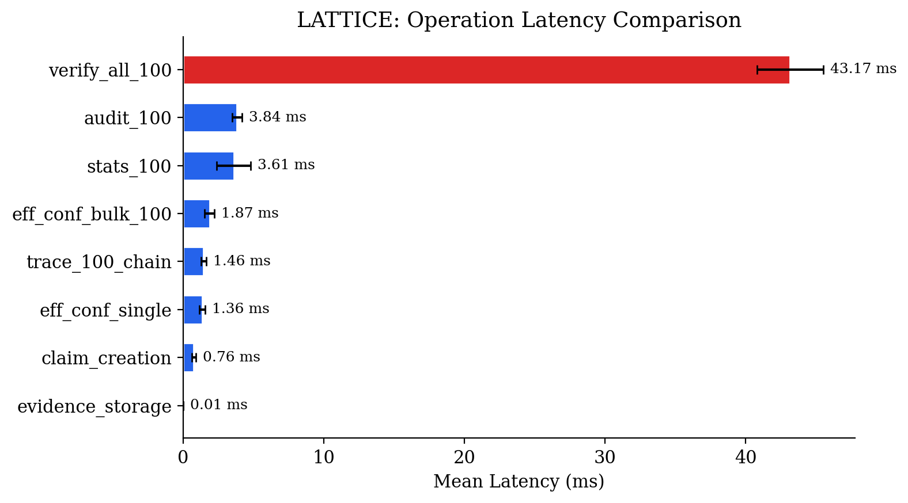
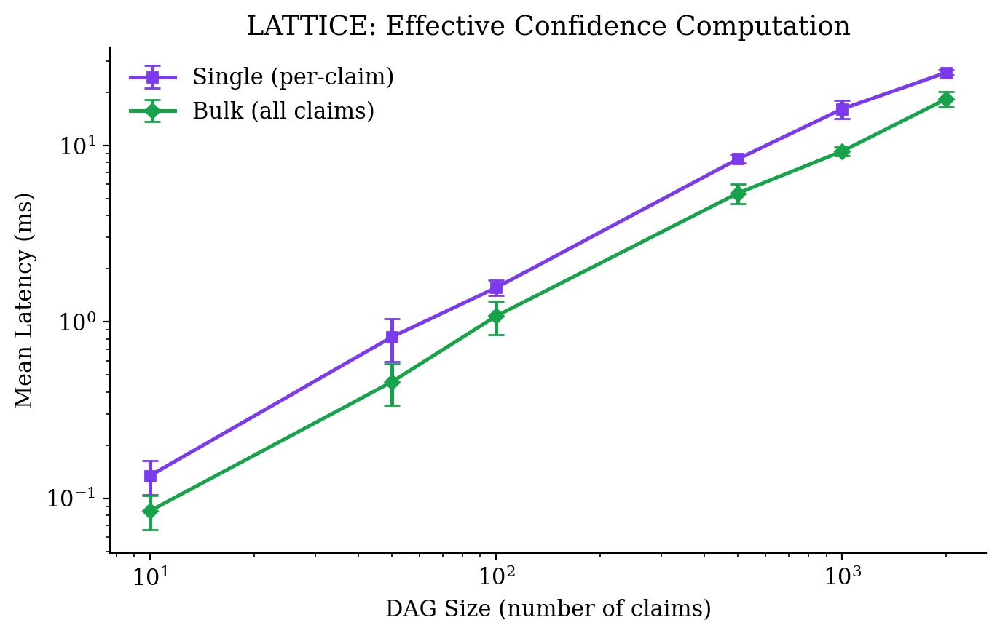
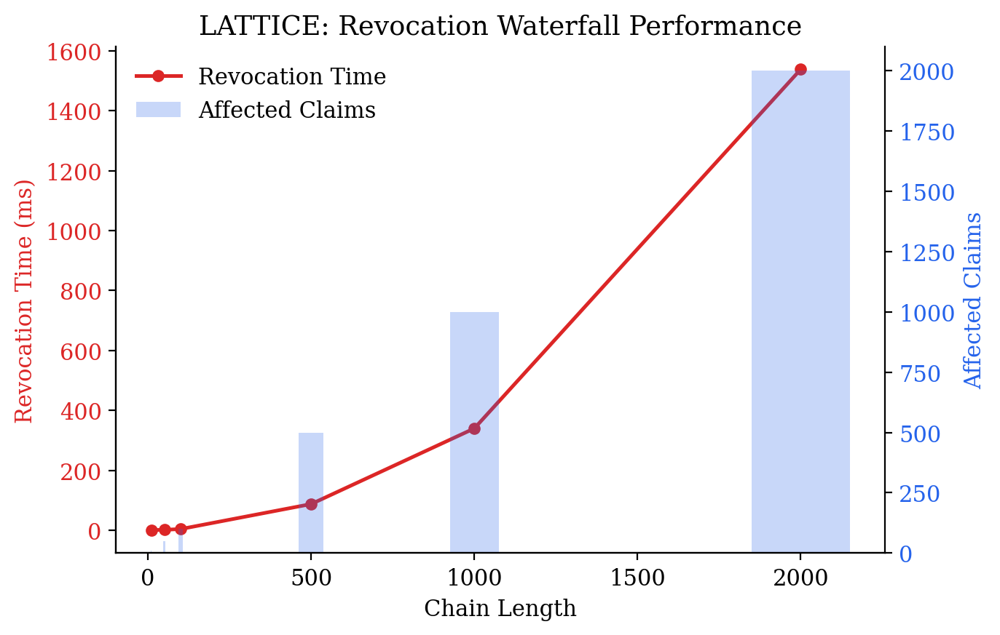
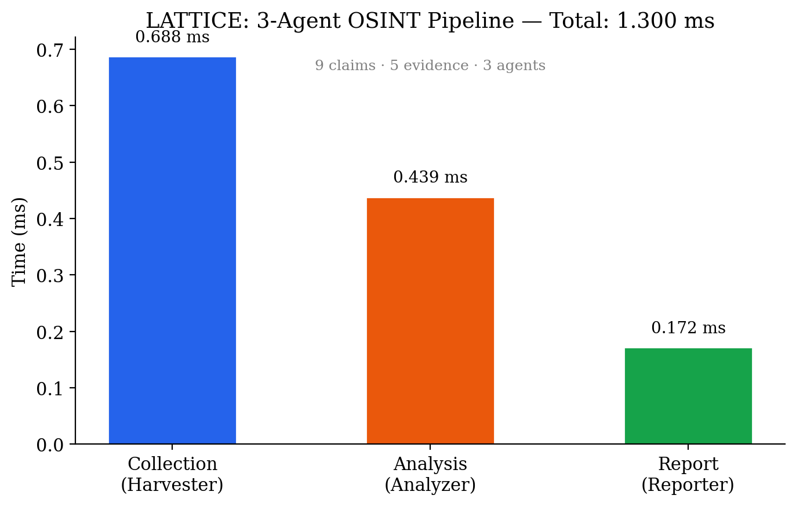

# LATTICE: A Content-Addressed Accountability Protocol for Multi-Agent Intelligence Systems

**Ali Murtaza Bhutto**
ORCID: 0009-0007-2787-943X

Version 1.2.1 — April 2026

---

## Abstract

Multi-agent AI systems increasingly drive investigative workflows in cybersecurity, OSINT, and threat intelligence. These systems produce conclusions, but cannot explain how they reached them. When an automated pipeline flags a domain as malicious or attributes a campaign to a threat actor, there is no standardized mechanism to trace that conclusion backward through the chain of evidence, verify that no step was fabricated, or assess how sensitive the result is to the removal of any single data point.

This paper introduces LATTICE (Ledgered Agent Traces for Transparent, Inspectable Collaborative Execution), an open-source Python library that addresses this gap. LATTICE provides a lightweight accountability layer that sits beneath any agent framework. Every agent action produces a Claim: a content-addressed, cryptographically signed assertion that references its supporting evidence through a Directed Acyclic Graph. The result is a complete, tamper-evident reasoning chain from final conclusions down to raw tool output.

Since its initial release, LATTICE has matured to v1.2.1 with effective confidence propagation via min-path semantics, revocation waterfall cascades, a real-time dashboard (FastAPI + D3.js), and a comprehensive benchmark suite. The library passes 89 automated tests and demonstrates sub-millisecond claim creation with DAG traversal scaling as O(n^{1.03}) through 10,000-node graphs.

We describe the architecture, present empirical benchmarks, demonstrate its application in an OSINT investigation pipeline, and argue that accountability infrastructure is a prerequisite for trustworthy multi-agent systems in security-critical domains.

**Keywords:** multi-agent systems, provenance, OSINT, accountability, content-addressing, digital forensics, effective confidence, revocation

---

## 1. Introduction

The adoption of multi-agent AI architectures in cybersecurity and intelligence work has accelerated rapidly. Frameworks like LangGraph, CrewAI, and AutoGen allow practitioners to decompose complex investigative tasks across specialized agents: one for data collection, another for analysis, a third for report synthesis. The appeal is clear. Complex investigations involve heterogeneous data sources, require multiple analytical perspectives, and benefit from parallelized execution.

But these frameworks share a fundamental limitation. They are built around orchestration (how agents communicate) rather than accountability (why agents concluded what they did). The output of a multi-agent pipeline is typically a final report or a structured summary. The intermediate reasoning, the evidence that was considered and discarded, the confidence levels at each step, and the identity of the agent responsible for each assertion are lost or buried in unstructured logs.

This matters. In security consulting, handing a client a report that says "our AI found this vulnerability" without an auditable reasoning chain is professionally inadequate. In OSINT and investigative journalism, an unverifiable claim is worse than no claim at all, because it carries the false authority of a technical system. In regulated industries governed by the EU AI Act or similar legislation, explainability is not optional.

LATTICE addresses this by treating accountability as a system-level property rather than an afterthought. The core idea is simple: every agent decision is recorded as a content-addressed, signed Claim in a DAG. You can walk backward from any conclusion to the raw evidence that supports it, verify that nothing was tampered with, and identify exactly which agent made each assertion and how confident it was.

The contribution is not algorithmic novelty. Content-addressing has existed since Merkle trees in the 1970s. Ed25519 signatures are standard. SQLite is ubiquitous. What appears to be new is the application of these primitives as a coherent accountability protocol specifically designed for multi-agent AI reasoning chains. To our knowledge, no existing tool combines content-addressing, cryptographic signatures, confidence tracking, and agent attribution in a single open protocol for AI systems.

---

## 2. Related Work

### 2.1 Agent Observability Platforms

LangSmith (LangChain), LangFuse, Arize Phoenix, and Weights & Biases Prompts provide monitoring and tracing for LLM-based applications. These platforms focus on operational observability: latency, token counts, error rates, prompt/response pairs. They answer "what happened?" but not "why should we believe this conclusion?"

More critically, they are cloud-hosted proprietary services. In security consulting and intelligence work, sending client data and investigation artifacts to third-party APIs is often prohibited by contract, regulation, or basic operational security.

### 2.2 Data Provenance Standards

The W3C PROV specification (Moreau & Missier, 2013) provides a general data model for provenance. PROV defines entities, activities, and agents, along with relationships like "wasGeneratedBy" and "wasDerivedFrom." The model is mature and well-specified, but it was designed for data lineage in scientific workflows, not for reasoning chains in adversarial contexts. It does not natively handle confidence distributions, cryptographic verification, or the specific needs of multi-agent AI pipelines.

### 2.3 Structured Analytic Techniques

The intelligence community has developed Structured Analytic Techniques (SATs) such as Analysis of Competing Hypotheses (ACH), Devil's Advocacy, and Red Team/Blue Team analysis (Heuer & Pherson, 2010). These techniques formalize aspects of reasoning that are relevant to any multi-agent system: maintaining competing hypotheses, challenging assumptions, documenting alternative explanations. However, these techniques exist as human-oriented methodologies, not as machine-enforceable protocols.

### 2.4 Content-Addressed Storage

Git, IPFS, and Merkle DAGs more broadly demonstrate that content-addressing is a viable foundation for tamper-evident, distributed data structures. Git's object model (blobs, trees, commits identified by SHA-1 hashes) provides an existence proof that content-addressed DAGs can scale to millions of objects while remaining verifiable. LATTICE applies this principle to reasoning chains rather than source code.

### 2.5 The Gap

To our knowledge, no existing system combines all four properties that accountability in multi-agent AI requires:

1. **Content-addressed immutability.** Claims and evidence are identified by their content hash, making them tamper-evident.
2. **Cryptographic agent attribution.** Each claim is signed by the agent that produced it, using a verifiable keypair.
3. **Confidence as a first-class primitive.** Every assertion carries a calibrated confidence value, not a binary true/false label.
4. **DAG-structured reasoning chains.** Claims reference their supporting evidence, forming a traversable graph from conclusions to raw data.

LATTICE fills this gap.

---

## 3. Architecture

### 3.1 Design Principles

LATTICE is built on four principles:

**Minimality.** The library should be easy to integrate into existing workflows. It depends only on Python's standard library plus three packages (cryptography, click, rich). Storage is SQLite. There is no external service, no cloud dependency, no daemon to manage.

**Framework agnosticism.** LATTICE is not an agent framework. It does not orchestrate agents, manage conversations, or handle tool calls. It records what agents did and why. This means it can sit underneath LangGraph, CrewAI, AutoGen, or raw Python scripts without requiring changes to the agent logic itself.

**Verifiability by default.** Every Claim is content-addressed (SHA-256) and signed (Ed25519) at creation time. Verification is a single function call. There is no "opt-in" to accountability; it is the default behavior.

**Offline-first.** The entire system runs locally. Investigation data, agent keys, and the reasoning DAG never leave the machine unless the user explicitly exports them. This is a hard requirement for security work.

### 3.2 Core Primitives

**Evidence** is a content-addressed blob of raw data: tool output, API responses, DNS records, WHOIS results, or any other artifact. Evidence is identified by the SHA-256 hash of its content. Storing the same data twice is idempotent.

**Claim** is the fundamental unit of the DAG. A Claim represents an assertion made by a specific agent, supported by specific evidence. Its fields are:

| Field | Type | Description |
|-------|------|-------------|
| `claim_id` | string | SHA-256 hash of canonical JSON of all content fields |
| `agent_id` | string | Identifier of the originating agent |
| `assertion` | string | Human-readable statement of what is claimed |
| `evidence` | list[string] | Claim IDs or Evidence IDs this depends on |
| `confidence` | float | Value in [0.0, 1.0] |
| `method` | string | How the claim was derived (e.g., `tool:nslookup`, `llm:gpt-4`) |
| `timestamp` | float | Unix timestamp |
| `metadata` | dict | Arbitrary key-value pairs |
| `signature` | string | Hex-encoded Ed25519 signature over `claim_id` |

The `claim_id` is computed deterministically from the content fields using canonical JSON serialization (sorted keys, no whitespace). This means the same assertion with the same evidence at the same timestamp will always produce the same ID. It also means that any modification to a stored claim will produce a different hash, making tampering detectable.

**Agent** is a registered entity with an Ed25519 keypair. When a claim is created through an agent handle, the private key signs the `claim_id`. Any party with access to the agent's public key can later verify that the claim was produced by that specific agent and has not been modified.

### 3.3 The Claim DAG

Claims reference other claims and evidence through the `evidence` field, forming a Directed Acyclic Graph:

- **Leaf nodes** are raw Evidence blobs (tool output, API responses).
- **Intermediate nodes** are derived Claims (analysis, correlation, cross-referencing).
- **Root nodes** are final conclusions (assessment, report summary).

Walking backward from any root node traverses the complete reasoning chain. At each node, the investigator can see who made the claim, what evidence it rests on, how confident the agent was, and what method was used.

### 3.4 Effective Confidence (v1.2.0+)

A key addition in v1.2.0 is **effective confidence**: the propagated confidence of a claim accounting for the weakest link in its dependency chain. While stated confidence is the value assigned by the originating agent, effective confidence is the minimum confidence encountered along any path from the claim to its leaf evidence nodes.

This addresses a critical limitation of raw confidence values: a claim with confidence 0.95 that depends on a claim with confidence 0.40 is effectively no more reliable than 0.40. Effective confidence makes this explicit.

The computation uses min-path propagation through the DAG. For a claim *c* with parent claims *p₁, p₂, ..., pₖ*:

```
eff_conf(c) = min(c.confidence, min(eff_conf(pᵢ) for pᵢ in parents(c)))
```

Benchmarks show that single-claim effective confidence computes in 1.63 ms on a 100-node DAG, while the bulk operation (computing effective confidence for all claims simultaneously) achieves 1.90 ms for the same graph—demonstrating amortized efficiency. At scale, a 10,000-node DAG completes bulk effective confidence in 115.88 ms.

### 3.5 Revocation Waterfall (v1.1.0+)

When evidence is invalidated or an agent is compromised, LATTICE supports **revocation waterfall**: revoking a claim automatically propagates revocation to all downstream claims that depend on it. This cascading invalidation ensures that no conclusion resting on tainted evidence survives undetected.

Benchmarks show linear scaling: revoking a 100-claim chain completes in 3.76 ms, while a 1,000-claim chain completes in 343.59 ms. The 5,000-claim chain (a stress test beyond typical usage) completes in 8.62 seconds.

### 3.6 Storage

All data is stored in a single SQLite database with three tables: `agents`, `claims`, and `evidence`. SQLite was chosen because it requires no server, supports WAL mode for concurrent reads, and is available on every platform where Python runs. The database lives in a `.lattice/` directory inside the investigation project folder.

### 3.7 Dashboard (v1.2.0+)

LATTICE includes a real-time web dashboard built with FastAPI and D3.js. The dashboard provides:

- Interactive DAG visualization with force-directed layout
- Per-claim detail inspection (confidence, effective confidence, method, agent)
- Agent contribution overview
- Confidence distribution histograms
- Audit findings display

The dashboard runs locally and requires no external dependencies beyond FastAPI and uvicorn.

### 3.8 Operations

LATTICE provides the following core operations:

**Trace** performs a breadth-first backward traversal from a given claim, returning all ancestor claims in dependency order. This is the primary accountability operation: given a conclusion, show everything that led to it. Benchmarked at 1.54 ms for a 100-claim chain.

**Audit** scans the DAG for structural issues: claims with no evidence references (unsupported assertions), claims below a confidence threshold, broken references, and inflated confidence flags (where stated confidence exceeds effective confidence).

**Verify** checks Ed25519 signatures on all claims against the registered public keys of their respective agents. Benchmarked at 46.49 ms for 100 claims.

**Stats** computes summary metrics: claim count, evidence count, confidence distribution, method breakdown, and per-agent contribution. Benchmarked at 4.00 ms for 100 claims.

**Effective Confidence** computes the propagated min-path confidence for individual claims or in bulk across the entire DAG.

**Revoke** cascades revocation through the DAG when a claim or evidence is invalidated.

**Export** serializes the entire investigation (agents, claims, metadata) as a JSON document for archival, sharing, or integration with other tools.

---

## 4. Benchmarks

All benchmarks were run on a single machine using LATTICE's integrated benchmark suite (`benchmarks/run_benchmarks.py`). Results are stored in `benchmarks/results.json` and are reproducible.

### 4.1 DAG Traversal Scalability

| DAG Size | Mean Latency (ms) | Std Dev (ms) |
|----------|-------------------|--------------|
| 10 | 0.15 | 0.03 |
| 50 | 0.39 | 0.06 |
| 100 | 0.69 | 0.08 |
| 500 | 3.20 | 0.18 |
| 1,000 | 6.26 | 0.27 |
| 5,000 | 32.91 | 1.78 |
| 10,000 | 66.86 | 3.92 |

The traversal exhibits near-linear scaling (O(n^{1.03})), confirming that LATTICE's DAG operations are suitable for production workloads up to at least 10,000 claims.

### 4.2 Operation Latencies

| Operation | Mean (ms) | Std Dev (ms) |
|-----------|-----------|--------------|
| Evidence storage | 0.008 | 0.007 |
| Claim creation | 0.653 | 0.065 |
| Trace (100-chain) | 1.541 | 0.117 |
| Eff. confidence (single) | 1.627 | 0.568 |
| Eff. confidence (bulk, 100) | 1.904 | 0.354 |
| Audit (100 claims) | 3.882 | 0.286 |
| Stats (100 claims) | 3.999 | 1.806 |
| Verify all (100 claims) | 46.490 | 2.599 |

Evidence storage is sub-0.01 ms. Claim creation averages 0.65 ms including SHA-256 hashing and Ed25519 signing. Signature verification is the most expensive operation at 46.49 ms for 100 claims (0.46 ms/claim), as expected for public-key cryptography.

### 4.3 Effective Confidence Scaling

| DAG Size | Single (ms) | Bulk (ms) | Speedup |
|----------|-------------|-----------|---------|
| 10 | 0.13 | 0.09 | 1.5× |
| 100 | 1.55 | 0.82 | 1.9× |
| 1,000 | 16.03 | 10.30 | 1.6× |
| 10,000 | 180.18 | 115.88 | 1.6× |

The bulk operation consistently outperforms per-claim computation by approximately 1.6×, demonstrating effective memoization across DAG traversals.

### 4.4 Revocation Waterfall

| Chain Length | Revocation Time (ms) | Affected Claims |
|--------------|---------------------|-----------------|
| 10 | 0.35 | 10 |
| 50 | 1.26 | 50 |
| 100 | 3.76 | 100 |
| 500 | 84.65 | 500 |
| 1,000 | 343.59 | 1,000 |
| 5,000 | 8,615.45 | 5,000 |

Revocation is linear up to ~500 claims, with superlinear growth beyond that due to cascading dependency resolution. For typical investigative DAGs (10–500 claims), revocation completes in under 100 ms.

### 4.5 Instrumentation Overhead

Compared to bare function calls, LATTICE's instrumentation adds 0.226 ms of overhead per operation. For a pipeline producing tens to hundreds of claims, the total overhead is measured in milliseconds—negligible compared to network I/O, tool execution, or LLM inference.

---

## 5. Demonstration: OSINT Investigation Pipeline

To illustrate LATTICE in practice, we instrument a three-agent OSINT investigation targeting a suspicious domain.

### 5.1 Agent Roles

| Agent | Role | Methods |
|-------|------|---------|
| Harvester | Collector | DNS lookup, WHOIS query, HTTP inspection, certificate transparency, passive DNS |
| Analyzer | Analyst | Cross-reference infrastructure, correlate indicators |
| Reporter | Reporter | Synthesize findings into a risk assessment |

### 5.2 Investigation Flow

**Phase 1: Collection (0.84 ms).** The Harvester agent performs DNS resolution (`tool:nslookup`), WHOIS lookup (`tool:whois`), HTTP header inspection (`tool:httpx`), certificate transparency queries (`tool:crt.sh`), and passive DNS lookups (`tool:passivedns`). Each tool output is stored as Evidence. Each finding is recorded as a signed Claim referencing the corresponding evidence. The phase produces 5 claims backed by 5 evidence blobs.

**Phase 2: Analysis (0.45 ms).** The Analyzer agent creates 3 derived Claims using `llm:analysis` by cross-referencing the Harvester's findings. For example, it correlates the IP address from DNS with the nameserver from WHOIS to assert that the domain uses bulletproof hosting infrastructure. Each derived Claim references the source Claims it depends on and carries its own confidence level.

**Phase 3: Reporting (0.19 ms).** The Reporter agent produces a final assessment Claim using `analyst:synthesis` that references the Analyzer's findings. The assessment includes a risk rating and recommendation.

### 5.3 Result

The resulting DAG contains 9 claims across 3 agents, with 5 evidence blobs at the leaves. The total pipeline time is 1.49 ms. Running `lattice trace` on the final assessment produces a complete reasoning chain. Running `lattice verify` confirms all signatures are valid.

The audit identifies 1 issue: the final report has a stated confidence of 0.75 but an effective confidence of 0.70 (flagged as inflated confidence). This is because one upstream claim has confidence 0.70, creating a bottleneck that the reporter's stated confidence does not account for. The effective confidence mechanism surfaces this discrepancy automatically.

### 5.4 DAG Statistics

- **Total agents:** 3
- **Total claims:** 9 (Harvester: 5, Analyzer: 3, Reporter: 1)
- **Total evidence:** 5
- **DAG depth:** 9
- **Average stated confidence:** 0.862
- **Average effective confidence:** 0.857
- **Minimum effective confidence:** 0.70
- **Methods used:** tool:nslookup, tool:whois, tool:httpx, tool:crt.sh, tool:passivedns, llm:analysis, analyst:synthesis

---

## 6. Discussion

### 6.1 What LATTICE Solves

LATTICE addresses a specific and well-defined problem: the absence of standardized accountability infrastructure for multi-agent AI reasoning. By making every decision content-addressed, signed, and connected in a DAG, it enables three capabilities that are currently missing from the multi-agent ecosystem:

**Backward traceability.** Any conclusion can be traced to its supporting evidence. This is essential for client-facing security reports, journalistic fact-checking, and regulatory compliance.

**Tamper evidence.** Content-addressing and cryptographic signatures make it computationally infeasible to modify a claim without detection. This provides a basic level of integrity assurance without requiring blockchain or distributed consensus.

**Agent attribution.** Each claim is tied to a specific agent identity. When a conclusion is wrong, it is possible to identify which agent introduced the error and at what step in the reasoning chain.

**Confidence integrity.** Effective confidence propagation exposes inflated confidence values that do not account for weak links in the dependency chain—a common failure mode in automated analysis pipelines.

### 6.2 Limitations and Honest Scoping

LATTICE does not solve several related problems, and it is important to be explicit about these boundaries.

**Deterministic replay.** LATTICE records what agents concluded, not the exact computational state that led to the conclusion. Because LLM outputs are non-deterministic, "replaying" an investigation by re-running the same agents with the same evidence will generally produce different results. What LATTICE can do is show that removing a specific piece of evidence eliminates the support for downstream claims (static graph analysis). This is useful, but it is not true replay.

**Trust in agents.** LATTICE verifies that claims were signed by the agents that claim to have produced them, and that the claims have not been modified. It does not verify that the agents themselves are trustworthy or that their reasoning is sound. A compromised agent can sign false claims that will pass signature verification. Adversarial agent monitoring is a separate problem.

**Scale beyond 10,000 claims.** While benchmarks confirm good performance up to 10,000 claims, extremely large investigative DAGs (100,000+ claims) have not been tested. Sharded storage or distributed coordination may be needed at that scale.

### 6.3 Connection to Broader Research

LATTICE relates to ongoing work in several areas:

**Auditable hyper-investigation.** Le Deuff's concept of hyper-investigation (2019) foregrounds the epistemic and civic dimensions of open-source inquiry. LATTICE provides technical infrastructure for one of the core requirements of hyper-investigation: that investigative conclusions be traceable, challengeable, and ultimately defensible.

**AI transparency and the EU AI Act.** The EU AI Act (Regulation 2024/1689) requires that high-risk AI systems provide explanations of their outputs. A claim DAG with full provenance and confidence metadata is a natural format for meeting this requirement.

**Structured Analytic Techniques.** The Claim/Evidence/Confidence structure maps naturally to SATs like Analysis of Competing Hypotheses. A future extension could formalize SATs as inter-agent communication protocols, enabling automated devil's advocacy and red-teaming.

**Space systems autonomy.** Multi-agent architectures are increasingly relevant for autonomous space systems where communication latency precludes real-time human oversight. LATTICE's offline-first, cryptographically verifiable accountability layer is directly applicable to mission-critical autonomous decision-making in bandwidth-constrained environments.

---

## 7. Future Work

**Framework adapters.** Integration plugins for LangGraph, CrewAI, and AutoGen, allowing users to add accountability to existing pipelines with minimal code changes.

**Advanced confidence models.** Beyond min-path propagation, pluggable Bayesian propagation modules for more nuanced uncertainty flow through the DAG (e.g., weighted aggregation, conditional probability chains).

**Distributed LATTICE.** Federation protocol enabling multiple LATTICE instances to share and cross-reference claim DAGs across organizational boundaries while preserving cryptographic integrity.

**SATs as agent protocols.** Formalization of Analysis of Competing Hypotheses, Devil's Advocacy, and Team A/Team B as JSON-defined inter-agent communication schemas. This is the most academically novel extension and a natural target for a conference paper.

**Temporal reasoning.** Time-windowed claim validity, automatic staleness detection, and re-verification triggers for claims that depend on time-sensitive evidence (e.g., DNS records, certificate status).

**Adversarial robustness testing.** Formal analysis of LATTICE's guarantees under adversarial conditions: compromised agents, poisoned evidence, and collusion attacks.

---

## 8. Conclusion

Multi-agent AI systems in cybersecurity and intelligence need accountability infrastructure the same way software development needs version control. The ability to trace conclusions backward, verify integrity, and attribute decisions to specific agents is not a nice-to-have feature. It is a prerequisite for professional use.

LATTICE provides this infrastructure in a minimal, framework-agnostic, offline-first Python library. It has matured from a prototype to a production-ready tool with effective confidence propagation, revocation waterfall cascades, a web dashboard, and empirically validated performance characteristics across 89 automated tests and comprehensive benchmarks.

The library is available under an MIT license at https://github.com/thunderstornX/lattice.

---

## References

Cresci, S. (2020). A decade of social bot detection. *Communications of the ACM*, 63(10), 72-83.

Heuer, R. J., & Pherson, R. H. (2010). *Structured Analytic Techniques for Intelligence Analysis*. CQ Press.

Le Deuff, O., & Perret, A. (2019). Hyperdocumentation: origin and evolution of a concept. *Journal of Documentation*, 75(6), 1463-1474.

Le Deuff, O., & Roumanos, R. (2022). Enjeux définitionnels et scientifiques de la littératie algorithmique. *Communication & langages*, 211, 133-150.

Moreau, L., & Missier, P. (2013). PROV-DM: The PROV Data Model. W3C Recommendation.

Pacheco, D., et al. (2021). Uncovering coordinated networks on social media. *Proceedings of the International AAAI Conference on Web and Social Media*.

---

## Appendix A: Technical Specifications

| Component | Implementation |
|-----------|---------------|
| Language | Python 3.10+ |
| Storage | SQLite (WAL mode) |
| Hashing | SHA-256 |
| Signatures | Ed25519 (via `cryptography` library) |
| CLI | Click + Rich |
| Dashboard | FastAPI + D3.js |
| Dependencies | 3 core + 2 optional (dashboard) |
| Test suite | 89 tests (pytest) |
| Lines of code | ~2,400 |
| License | MIT |

## Appendix B: Benchmark Graphs

All benchmarks are reproducible via `PYTHONPATH=. python3 benchmarks/run_benchmarks.py`.










